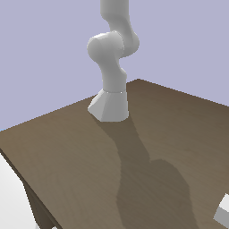
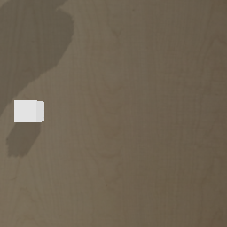

# panda-visual

A minimal implementation for camera placement and enhanced rendering.

## Install and Run

```bash

# Download
git clone https://github.com/panda-sim/panda-visual.git
cd panda-visual

# Create and source virtual environment
python3 -m venv venv
source venv/bin/activate

# Install dependencies
pip install numpy pybullet matplotlib

# Run the script
python main.py
```

## Acceleration

Note that copying pixels from C/C++ to Python can be really slow for large images, unless you
compile PyBullet using NumPy. You can check if NumPy is enabled using PyBullet.isNumpyEnabled(), as shown below:

```bash
python -c "import importlib.metadata; print('NumPy version:', importlib.metadata.version('numpy'))"
python -c "import importlib.metadata; print('PyBullet version:', importlib.metadata.version('pybullet'))"
python -c "import pybullet; print('NumPy enabled:', pybullet.isNumpyEnabled())"
```

The function getCameraImage is accelerated using numpy, so hopefully NumPy enabled: 1.
If this is not the case, you could try switching to Python 3.10 (an older version of python).
This may or may not work, depending on the newer versions of NumPy and PyBullet.

## Expected Output

Running the code should save images to the file "images."
Images labeled `-1` are for the fixed camera, and images labeled `-2` are for the camera mounted to the end-effector.
The first pair of images output by the code are shown below.


